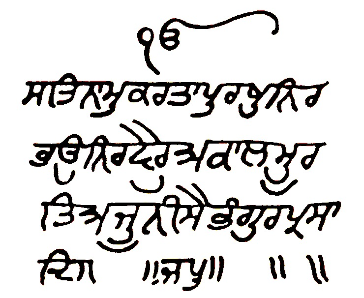

0 to ੴ

ੴਸਤਿਨਾਮੁਕਰਤਾਪੁਰਖੁਨਿਰਭਉਨਿਰਵੈਰੁਅਕਾਲਮੂਰਤਿਅਜੂਨੀਸੈਭੰਗੁਰਪ੍ਰਸਾਦਿ॥

Hi, it's Prabhchintan Randhawa from Austin,Texas. I made an open-source <a href="https://github.com/prabhchintan/website">notebook on GitHub</a>. I will add to it gradually. Do subscribe.